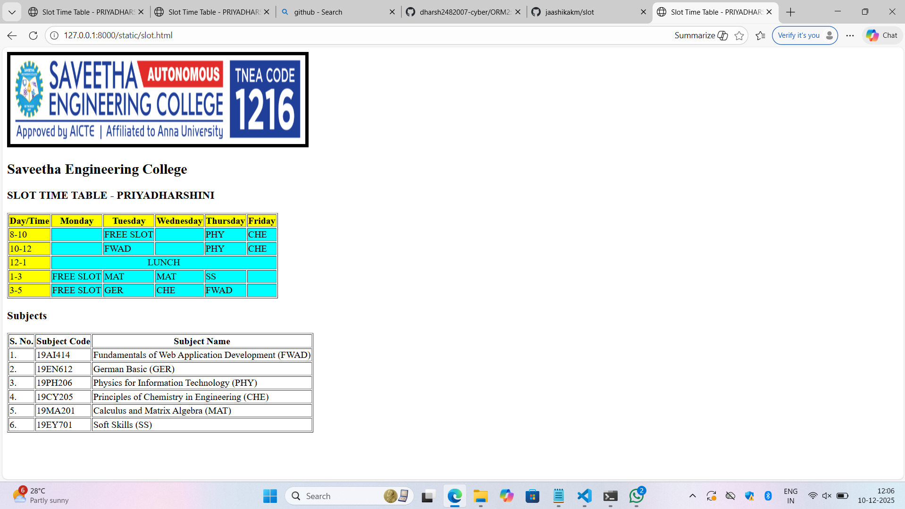

# Ex03 Time Table
## Date:26/11/2025

## AIM
To write a html webpage page to display your slot timetable.

## ALGORITHM
### STEP 1
Create a Django-admin Interface.

### STEP 2
Create a static folder and inert HTML code.

### STEP 3
Create a simple table using ```<table>``` tag in html.

### STEP 4
Add header row using ```<th>``` tag.

### STEP 5
Add your timetable using ```<td>``` tag.

### STEP 6
Execute the program using runserver command.

## PROGRAM

```
<html>
    <head>
        <title>slot</title>
    </head>
    <body>
        <div style="text-align:center;">
        
        </div>
        <div style="margin-top: 30px;"> </div>

        <table bgcolor="#A4F0F2" border="5" width="800" height="200" align="center" border="1">
            <caption><b>SLOT TIME TABLE-P.PRIYADHARSHINI (25012009)</b></caption>
            <tr bgcolor="yellow">
                <th>DAY/TIME</th>
                <th>MONDAY</th>
                <th>TUESDAY</th> 
                <th>WEDNESDAY</th>
                <th>THURSDAY</th>
                <th>FRIDAY</th>
            </tr>
            <tr>
                <td bgcolor="yellow" align="center">8-10</td>
                <td colspan="3" align="center">FREE SLOT</td>
                <td align="center">PHY</td>
                <td align="center">CHE</td>
            </tr>
            <tr>
                <td bgcolor="yellow" align="center">10-12</td>
                <td align="center">GER</td>
                <td align="center">FREE SLOT</td>
                <td align="center">FWAD</td>
                <td align="center">FWAD</td>
                <td align="center">PHY</td>
            </tr>
            <tr>
                <td bgcolor="yellow" align="center">12-1</td>
                <td colspan="5" align="center">LUNCH</td>
            </tr>
            <tr>
                <td bgcolor="yellow" align="center">1-3</td>
                <td align="center" colspan="2">FREE SLOT</td>
                <td align="center">MAT</td>
                <td align="center">MAT</td>
                <td align="center">SS</td>
            </tr>
            <tr>
                <td bgcolor="yellow" align="center">3-5</td>
                <td align="center" colspan="2">FREE SLOT</td>
                <td align="center">GER</td>
                <td align="center">CHE</td>
                <td align="center">FWAD</td>
            </tr>
        </table>
        <div style="margin-top: 40px;"> </div>
        <table border="1" width="800" height="195" align="center">
            <tr> 
                <th>S.NO.</th>
                <th>Subject Code</th>
                <th>Subject Name</th>
            </tr>
            <tr>
                <td align="center">1.</td>
                <td align="center">19AI414</td>
                <td>Fundamentals of Web Application Development(FWAD)</td>
            </tr>
            <tr>
                <td align="center">2.</td>
                <td align="center">19EN612</td>
                <td>German Basic(GER)</td>
            </tr>
            <tr>
                <td align="center">3.</td>
                <td align="center">19PH206</td>
                <td>Physics for Information Techology(PHY)</td>
            </tr>
            <tr> 
                <td align="center">4.</td>
                <td align="center">19CY205</td>
                <td>Physics Of Chemistry in Engineering(CHE)</td>
            </tr>
            <tr>
                <td align="center">5.</td>
                <td align="center">19MA201</td>
                <td>Calculus Matrix Algebra(MAT)(PHY)</td>
            </tr>
            <tr>
                <td align="center">6.</td>
                <td align="center">19EY701</td>
                <td>Social Skills(SS)</td>
            </tr>
        </table>
    </body>
</html>

```

## OUTPUT



## RESULT
The program for creating slot timetable using basic HTML tags is executed successfully.
